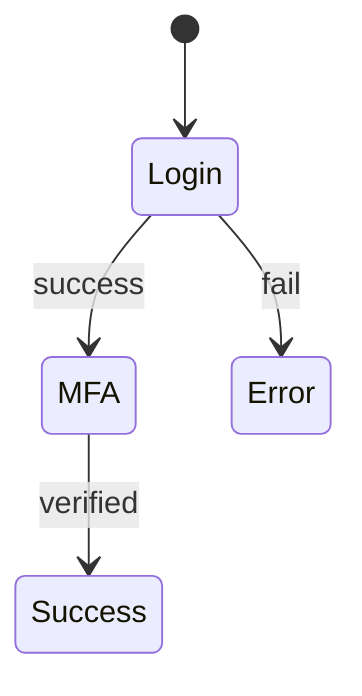

# Flow2State

Flow2State is a developer tool that converts Mermaid-based workflow definitions into executable TypeScript state machine code with live diagram preview.

Instead of manually writing switch statements or state transition logic, developers define workflows using a simple Mermaid DSL and let Flow2State generate the implementation.

---

## Overview

Flow2State transforms Mermaid workflow definitions into an intermediate representation (IR), which becomes the single source of truth for rendering, validation, and code generation.

```text
Mermaid DSL
    ↓
Parser
    ↓
State Machine IR
    ↓
+----------------------+----------------------+
| Live Renderer        | TypeScript Generator |
+----------------------+----------------------+
    ↓
Diagram Preview + Generated Code
```

---

## Why Flow2State?

Modern applications contain many workflows:

* Authentication flows
* Order processing
* Approval systems
* Onboarding processes
* Payment pipelines
* Multi-step forms

These workflows are often implemented using:

* nested if statements
* switch cases
* scattered business logic

This approach frequently introduces invalid transitions, unreachable states, and difficult-to-maintain code.

Flow2State solves this by making the workflow itself the primary artifact.

---

## Core Features

### Mermaid → State Machine IR

Convert Mermaid workflow definitions into a structured intermediate representation.

Example input:



Generated IR:

```ts
{
  initial: "Login",
  states: {
    Login: {
      on: {
        success: "MFA",
        fail: "Error"
      }
    },
    MFA: {
      on: {
        verified: "Success"
      }
    }
  }
}
```

Benefits:

* Structural validation
* State consistency guarantees
* Invalid transition prevention

---

### IR → TypeScript Generator

Generate executable TypeScript state machine code directly from the IR.

Example output:

```ts
export const authFlowMachine = {
  initial: "Login",

  states: {
    Login: {
      on: {
        success: "MFA",
        fail: "Error"
      }
    },

    MFA: {
      on: {
        verified: "Success"
      }
    }
  }
} as const;
```

Benefits:

* Production-ready code generation
* Elimination of large switch statements
* Reduced state transition bugs

---

### Live Diagram Preview

Render workflow diagrams in real time while editing Mermaid definitions.

```text
+------------------------+------------------------+
| Mermaid Editor         | Live Diagram           |
|------------------------|------------------------|
| Login --> MFA          | Login → MFA            |
| MFA --> Success        |      ↓                 |
|                        |   Success              |
+------------------------+------------------------+
```

Features:

* 100-300ms debounce rendering
* Instant visual feedback
* IR-based synchronization

---

## Design Principles

### IR is the Source of Truth

The state machine IR is the central model of the system.

```text
Mermaid DSL
    ↓
IR
   ↙ ↘
Renderer Generator
```

* Mermaid is an input format.
* Generated code is an output artifact.
* The IR owns the business logic.

---

### Deterministic Compiler First

Flow2State focuses on deterministic compilation.

The MVP intentionally excludes:

* AI flow generation
* Git integration
* Backend generation
* Workflow execution engines

These can be added later without changing the core architecture.

---

## Current MVP Scope

### Included

* Mermaid parser
* State machine IR
* TypeScript code generator
* Live diagram preview
* Structural validation

### Excluded

* Nested states
* Parallel states
* Timers
* Actors
* AI-assisted generation
* Version control integration

---

## Example Use Cases

* Authentication flows
* Checkout processes
* Approval workflows
* Ticket lifecycle management
* User onboarding
* Internal business processes

---

## Project Philosophy

Define the workflow once.

Everything else should be generated.
